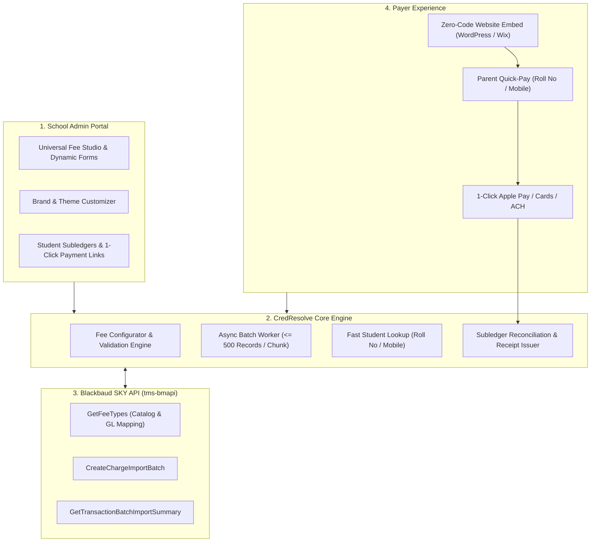

# CredResolve Universal Fee Layer & Blackbaud SKY API Integration Engine

A modern, high-converting non-tuition fee layer and payment portal designed for K-12 private schools and higher-ed institutions, natively integrated with **Blackbaud Billing Management** via the Blackbaud SKY API (`tms-bmapi`).

---

## 🌟 Key Features

1. **Universal Fee Studio**:
   - Create, configure, and post non-tuition fees (educational excursions, STEM lab kits, athletic uniforms, AP exam fees) with automated General Ledger distribution account mapping (`GetFeeTypes`).
   - Dynamic custom forms (t-shirt sizing, emergency phone numbers, dietary restrictions).
   - Electronic liability waiver capture with digital signatures and timestamp verification.
   - Audience targeting by Grade Level, Athletic Roster, or Whole School.

2. **Parent Self-Service Quick-Pay Portal**:
   - Frictionless parent checkout without passwords or complex ERP logins.
   - Self-service lookup by **Student Roll Number / ID** (e.g. `BB-STU-101`) or **Parent Mobile Phone Number**.
   - Instant calculation of outstanding subledger dues and partial payment installment support.
   - Modern 1-touch payment checkout:  **Apple Pay**, **Google Pay**, **Credit/Debit Cards**, and **ACH Direct Debit**.
   - Subledger-reconciled official receipts (`REC-XXXXXX`).

3. **Zero-Code Website Pay Widget Integration**:
   - Embeddable onto existing school websites (WordPress, Wix, Squarespace, Webflow, custom CMS) with zero code.
   - 3 embed formats: **Inline Card Embed**, **Floating Pay Button & Popover Modal**, and **Dedicated Hosted Link**.
   - Interactive live browser sandbox for testing embed performance before publishing.

4. **Blackbaud SKY API Auto-Injection Pipeline (`tms-bmapi`)**:
   - Asynchronous batch ingestion with automatic chunking ($\le 500$ records per batch) satisfying Blackbaud API quotas.
   - Exponential backoff polling on `GetTransactionBatchImportSummary`.
   - Row-level validation diagnostics and error isolation (`STUDENT_NOT_FOUND`, `GL_ACCOUNT_INACTIVE`).

5. **School Brand & Theme Customization**:
   - White-label customization with school crest/logo uploads, custom primary/secondary color pickers, and live preview.
   - High-contrast presets including **Crisp Minimalist White**, **Classic Academic White**, and **Electric Indigo**.

---

## 🏗️ Architecture



---

## 🚀 Quick Start

### Prerequisites
* Node.js v18+
* npm

### Installation
```bash
# Clone the repository
git clone https://github.com/abhipuja1995/credresolve-fee-layer.git
cd credresolve-fee-layer

# Install dependencies for both server and client
npm install
```

### Running Locally
```bash
# Run both frontend and backend concurrently
npm run dev
```

* **Frontend UI**: `http://localhost:5174`
* **Backend API**: `http://localhost:3001`

### Running Automated Tests
```bash
# Run backend Vitest test suite
npm test
```

---

## 📄 License
MIT
